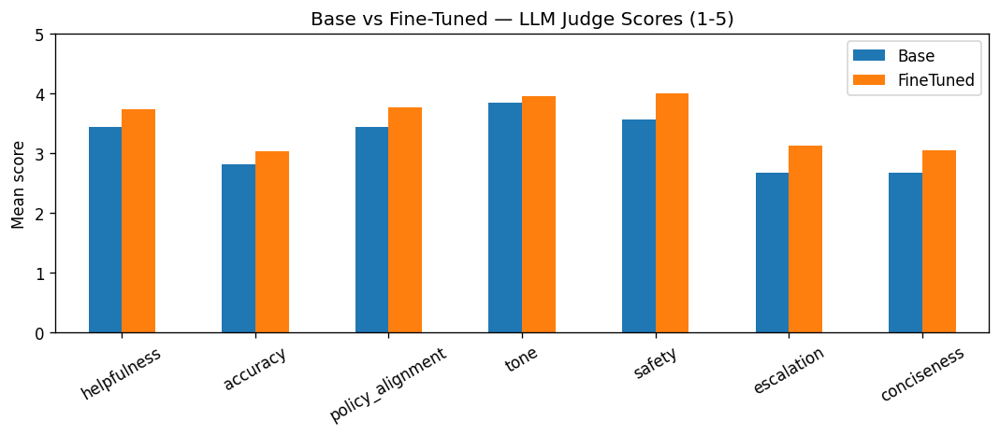

# 🌱 BAMBOO TUNE: Agritech Customer Service Assistant


## Overview

This repository contains the complete fine-tuning and evaluation pipeline for **BAMBOO TUNE**, a domain-specialized customer-service assistant built for an agritech company as a capstone project. It fine-tunes a compact open-source language model on a curated support dataset, benchmarks it against the base model with an automated LLM judge, and serves the winning model through an interactive web interface.

The assistant answers real customer questions about **agricultural chemicals, microbial agents, and water-soluble fertilizers** — covering dosage, mixing ratios, application timing, product compatibility, and safety — in a concise, on-label style. To keep responses safe and reliable, the model is trained to stay strictly within the company's product knowledge and to escalate or ask for clarification instead of inventing information.

## Key Features

**Curated Support Dataset:** A hand-audited dataset of customer-service conversations (312 train / 38 validation / 39 test), repaired for dilution-math errors, leaked annotations, and repeated phrasing, with expanded coverage of safety-critical scenarios.

**Efficient QLoRA Fine-Tuning:** Fine-tunes **Qwen1.5-1.8B-Chat** using 4-bit quantization (QLoRA via `bitsandbytes` + PEFT/TRL), making the entire training run reproducible on a single free **Google Colab T4 GPU**.

**LLM-as-a-Judge Evaluation:** Benchmarks the base and fine-tuned models on a held-out test set using **GPT-4o-mini** as an automated judge, scoring every answer across seven quality dimensions such as accuracy, safety, conciseness, and escalation handling.

**Themed Streamlit Deployment:** Serves the fine-tuned assistant through a custom forest-green **BAMBOO TUNE** chat interface that loads the trained LoRA adapter directly from the Hugging Face Hub — no local weights required.

## Model Performance Comparison

The evaluation script scored the base and fine-tuned models on the test set with the GPT-4o-mini judge. Iterative dataset improvements raised the average score across all dimensions, with the largest gains in **Safety**, **Escalation**, and **Conciseness**.

| Model | Average Judge Score (1–5) |
|---|---|
| Qwen1.5-1.8B-Chat (base) | 3.10 |
| BAMBOO TUNE — QLoRA (first run) | 3.21 |
| **BAMBOO TUNE — QLoRA (improved dataset)** | **3.52** |



**Result:** Fine-tuning with QLoRA produced a measurable, judge-verified improvement over the base model — the assistant became safer, more concise, and better at escalating when a question fell outside its knowledge.

## Code Structure: Inference & Deployment

The deployment phase connects the fine-tuned language model to the web front-end:

**The System Prompt (`SYS`):** A strict instruction block enforces the assistant's behavior — maximum two sentences, no invented information, and a clarifying question whenever details are missing. This is what keeps answers short, factual, and on-label.

**Model Loading (`load`):** Loads the Qwen1.5-1.8B-Chat base model and applies the trained LoRA adapter from the Hugging Face Hub (`nuhaai/bamboo-tune-model`) using PEFT, then caches it in memory for fast inference.

**Answer Generation (`answer`):** Builds a chat-templated prompt from the recent conversation history and generates a controlled response (low temperature, repetition penalty) so replies stay focused and consistent.

**Streamlit Front-End (`app.py`):** Runs the themed BAMBOO TUNE chat UI on port `8501`, with quick-question buttons for common support tasks (mixing, application frequency, crop safety).

## Getting Started

### Prerequisites

Install the core dependencies with pip. The app and the training pipeline have separate requirement files so you only install what you need.

```bash
# Run the app (inference only)
pip install -r requirements.txt

# Reproduce training & evaluation
pip install -r requirements-train.txt
```

### Run the App

```bash
streamlit run app.py
```

The app loads the base model and the LoRA adapter from Hugging Face automatically, so no local model files are required.

### Reproduce Training & Evaluation

Open `bamboo_tune_pipeline.ipynb` on a **T4 GPU** (Colab) and run the phases in order:

| Phases | Step |
|---|---|
| 1–3 | Load, validate, and profile the dataset (leakage check) |
| 4–5 | Install dependencies; tokenize and set `max_length` |
| 6–8 | Configure QLoRA, fine-tune, and save the adapter |
| 9–10 | Generate base and fine-tuned answers on the test set |
| 11–12 | Score with the GPT-4o-mini judge; build the comparison table + chart |

Two secrets are required for training/evaluation (Colab → 🔑 Secrets or environment variables):
- `OPENAI_API_KEY` — the GPT-4o-mini judge
- `WANDB_API_KEY` — experiment tracking (optional)

## Tech Stack

Python · PyTorch · Hugging Face **Transformers / PEFT / TRL** · **bitsandbytes** · **Weights & Biases** · OpenAI API (judge) · **Streamlit**

## Limitations & Responsible Use

This assistant is a research and portfolio project. It can produce incorrect or incomplete answers and is **not a substitute for professional agronomic advice**. For agricultural chemicals and fertilizers, always follow the official product label and local regulations. Do not rely on the model for safety-critical dosage or handling decisions.

## Data

The dataset encodes a real company's product information and is kept **private**, so it is **not included** in this repository. The training pipeline expects conversation data in JSONL chat format (each line a `{"messages": [...]}` record with `system`, `user`, and `assistant` turns). To reproduce training, supply your own data in the same format.

## Team

Developed as part of the SDA AI Engineering Bootcamp.

- Nuha Alqurashi
- Roaa Althagafi
- Kholud AlGamdi

## License

Released under the MIT License (see [LICENSE](LICENSE)). The Qwen1.5 base model and any third-party data are subject to their own licenses.
